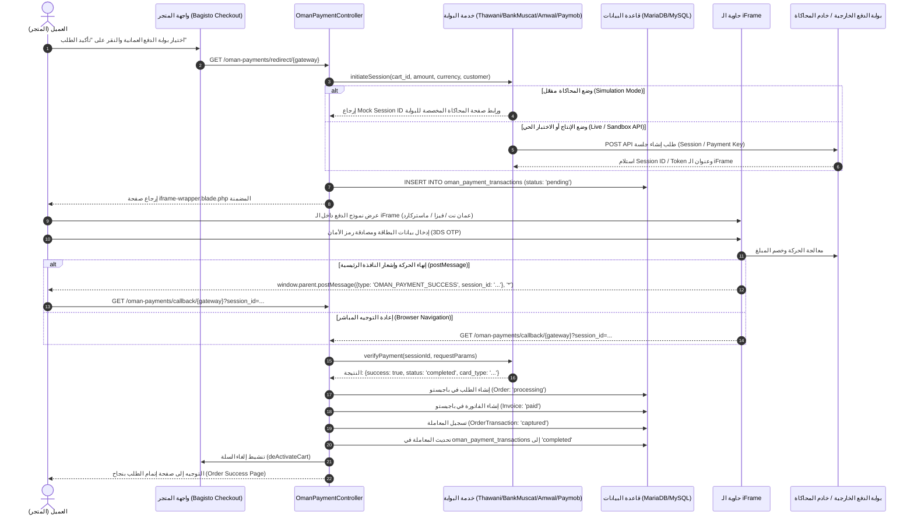
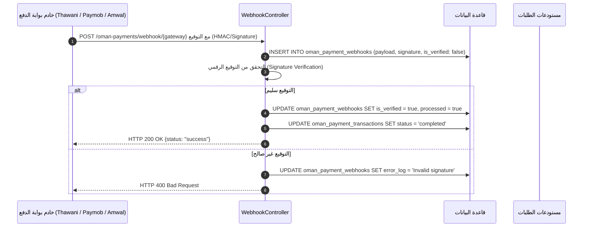

# البنية المعمارية وتدفق البيانات وقواعد البيانات
# Oman Payments Architecture & Data Flow Specification

توثق هذه الوثيقة البنية التقنية، وتدفق البيانات، ومخطط قواعد البيانات، وهيكلية الملفات لحزمة بوابات الدفع العُمانية في متجر **Bagisto**.

---

## 1. المعمارية العامة للطبقات (System Architecture Layers)

تم تصميم الحزمة وفق نمط **المعمارية النظيفة (Clean Architecture)** مقسمة إلى 4 طبقات واضحة تضمن الاستقلالية وقابلية الصيانة والتوسع:

```
+-----------------------------------------------------------------------------+
|                      1. طبقة العرض والواجهة (Presentation Layer)            |
|  - لوحة تحكم باجيستو (Bagisto Admin - Sales/Payment Methods System Config)   |
|  - واجهة إنهاء الطلب للمتجر (Shop Checkout View)                            |
|  - إطار الـ iFrame المدمج وحاويته المتجاوبة (iframe-wrapper.blade.php)      |
|  - واجهات المحاكاة التفاعلية (Thawani, Bank Muscat, Amwal, Paymob Simulators)|
+-----------------------------------------------------------------------------+
                                       │
                                       ▼
+-----------------------------------------------------------------------------+
|                 2. طبقة المتحكمات والتوجيه (Http & Controllers)             |
|  - OmanPaymentController: إدارة التوجيه، بدء الجلسة، والتحقق من Callback   |
|  - SimulationController: تقديم شاشات المحاكاة التفاعلية للـ iFrame          |
|  - WebhookController: استقبال وتوثيق إشعارات الدفع الآلية من البنوك         |
+-----------------------------------------------------------------------------+
                                       │
                                       ▼
+-----------------------------------------------------------------------------+
|                 3. طبقة الخدمات وبوابات الدفع (Payment Services Layer)      |
|  - OmanPaymentGatewayInterface (العقد الموحد)                               |
|  - ThawaniPayment & ThawaniService (بروتوكول ثواني باي)                     |
|  - BankMuscatPayment & BankMuscatService (بروتوكول MPGS لبنك مسقط)           |
|  - AmwalPayment & AmwalService (بروتوكول Secure Hash لأموال باي)            |
|  - PaymobPayment & PaymobService (بروتوكول التوكن والـ iFrame لباي موب)     |
+-----------------------------------------------------------------------------+
                                       │
                                       ▼
+-----------------------------------------------------------------------------+
|               4. طبقة البيانات والتخزين (Persistence & Domain Layer)         |
|  - جدول المعاملات العمانية: oman_payment_transactions                       |
|  - جدول إشعارات الويب هوك: oman_payment_webhooks                            |
|  - مستودعات باجيستو الأساسية: OrderRepository, InvoiceRepository, etc.     |
+-----------------------------------------------------------------------------+
```

---

## 2. مخطط تدفق البيانات (Data Flow Sequence Diagram)

### دورة الدفع الكاملة عبر الـ iFrame:



---

## 3. تدفق إشعارات الويب هوك (Webhook Data Flow)

تعمل البوابات على إرسال إشعارات خلفية غير متزامنة (Asynchronous Server-to-Server Webhooks) لضمان تسجيل العمليات حتى في حال انقطاع اتصال العميل:



---

## 4. مخطط قواعد البيانات (Database Schema Details)

### أ. جدول المعاملات العمانية: `oman_payment_transactions`

| اسم الحقل | النوع البرمجي | الفهارس والقيود | الشرح التفصيلي |
| :--- | :--- | :--- | :--- |
| `id` | `BIGINT UNSIGNED` | `PRIMARY KEY, AUTO_INCREMENT` | المعرف الرقمي الفريد |
| `transaction_id` | `VARCHAR(191)` | `UNIQUE, INDEX` | معرف المعاملة لدى البوابة أو رمز الجلسة |
| `gateway` | `VARCHAR(50)` | `INDEX` | رمز البوابة (`oman_thawani`, `oman_bankmuscat`, `oman_amwal`, `oman_paymob`) |
| `order_id` | `INT UNSIGNED` | `NULLABLE, INDEX, FOREIGN KEY` | رقم الطلب المرتبط في جدول `orders` بباجيستو |
| `cart_id` | `INT UNSIGNED` | `NULLABLE, INDEX` | رقم سلة التسوق الأصلية |
| `session_id` | `VARCHAR(191)` | `NULLABLE, INDEX` | معرف جلسة الدفع للـ iFrame |
| `amount` | `DECIMAL(12, 4)` | `DEFAULT 0.0000` | إجمالي المبلغ بالريال العماني (3 إلى 4 منازل عشرية) |
| `currency` | `VARCHAR(10)` | `DEFAULT 'OMR'` | رمز العملة (الريال العماني) |
| `status` | `VARCHAR(30)` | `INDEX, DEFAULT 'pending'` | حالة الدفع: `pending`, `completed`, `failed`, `cancelled` |
| `payment_mode` | `VARCHAR(20)` | `DEFAULT 'live'` | بيئة المعاملة: `live`, `sandbox`, `simulation` |
| `card_type` | `VARCHAR(50)` | `NULLABLE` | نوع البطاقة المستخدمة (مثل: `OmanNet Debit`, `Visa`, `Mastercard`) |
| `iframe_url` | `TEXT` | `NULLABLE` | الرابط الكامل المحمل داخل إطار الـ iFrame |
| `response_data` | `JSON` | `NULLABLE` | الاستجابة الكاملة الخام من خادم البوابة لأغراض التدقيق والمراجعة |
| `created_at` | `TIMESTAMP` | `NULLABLE` | تاريخ ووقت إنشاء الحركة |
| `updated_at` | `TIMESTAMP` | `NULLABLE` | تاريخ ووقت آخر تحديث للحالة |

### ب. جدول إشعارات الويب هوك: `oman_payment_webhooks`

| اسم الحقل | النوع البرمجي | الفهارس والقيود | الشرح التفصيلي |
| :--- | :--- | :--- | :--- |
| `id` | `BIGINT UNSIGNED` | `PRIMARY KEY, AUTO_INCREMENT` | المعرف الأساسي |
| `gateway` | `VARCHAR(50)` | `INDEX` | رمز البوابة المرسلة للإشعار |
| `event_type` | `VARCHAR(100)` | `NULLABLE, INDEX` | نوع الحدث (مثل: `payment_successful`, `checkout.session.completed`) |
| `payload` | `JSON` | - | البيانات الكاملة الواردة من خادم البوابة |
| `signature` | `VARCHAR(255)` | `NULLABLE` | قيمة التوقيع الرقمي أو الـ HMAC للتحقق |
| `is_verified` | `BOOLEAN` | `DEFAULT FALSE` | هل تم التأكد من أصالة التوقيع ومصدر الإشعار |
| `processed` | `BOOLEAN` | `DEFAULT FALSE` | هل تم تطبيق الأثر المالي وتحديث المعاملة بنجاح |
| `error_log` | `TEXT` | `NULLABLE` | تفاصيل أي خطأ وقع أثناء معالجة الإشعار |
| `created_at` / `updated_at`| `TIMESTAMP` | - | توقيت الاستلام والتحديث |

---

## 5. دليل الملفات وهيكلية الحزمة (File Manifest & Responsibilities)

```
packages/NumbersNebula/OmanPayments/
├── composer.json
│   └── تعريف حزمة مستقلة باسم numbersnebula/bagisto-oman-payments مع الـ PSR-4 ومزود الخدمة.
├── README.md
│   └── دليل التثبيت والتكوين السريع بالعربية والإنجليزية.
├── ARCHITECTURE.md
│   └── وثيقة المعمارية التفصيلية وتدفق البيانات وقواعد البيانات (هذا الملف).
├── src/
│   ├── Config/
│   │   ├── payment-methods.php
│   │   │   └── تسجيل مصفوفة بوابات الدفع في باجيستو وربطها بالفئات المسؤولة.
│   │   └── system.php
│   │       └── حقول إعدادات البوابات الأربع في لوحة الإدارة (Settings > Configure > Sales > Payment Methods).
│   ├── Contracts/
│   │   └── OmanPaymentGatewayInterface.php
│   │       └── العقد الموحد الذي يعرف دوال: initiateSession, verifyPayment, handleWebhook, isSimulationMode, getIframeUrl.
│   ├── Payment/
│   │   ├── AbstractOmanPayment.php
│   │   │   └── الفئة التجريدية الأساسية الموروثة من Webkul\Payment وتطبيق العقد العماني.
│   │   ├── ThawaniPayment.php
│   │   │   └── تعريف بوابة ثواني وربطها بخدمة ThawaniService.
│   │   ├── BankMuscatPayment.php
│   │   │   └── تعريف بوابة بنك مسقط وربطها بخدمة BankMuscatService.
│   │   ├── AmwalPayment.php
│   │   │   └── تعريف بوابة أموال باي وربطها بخدمة AmwalService.
│   │   └── PaymobPayment.php
│   │       └── تعريف بوابة باي موب عمان وربطها بخدمة PaymobService.
│   ├── Services/
│   │   ├── ThawaniService.php
│   │   │   └── منطق الاتصال بـ API ثواني، وتوليد جلسة Checkout Session، والتحقق، والمحاكاة.
│   │   ├── BankMuscatService.php
│   │   │   └── منطق الاتصال بخادم MPGS لبنك مسقط، وبدء الجلسة INITIATE_CHECKOUT، وتضمين الـ iFrame.
│   │   ├── AmwalService.php
│   │   │   └── منطق توليد التوقيع الرقمي Secure Hash (HMAC-SHA256)، واستدعاء SmartBox لأموال باي.
│   │   └── PaymobService.php
│   │       └── منطق المصادقة والـ Auth Tokens، وتسجيل الطلب، واستخراج Payment Key للـ iFrame.
│   ├── Http/
│   │   └── Controllers/
│   │       ├── OmanPaymentController.php
│   │       │   └── إدارة تدفق الدفع: التوجيه لعرض الـ iFrame، واستقبال الـ Callbacks، وإنشاء الطلب والفاتورة.
│   │       ├── SimulationController.php
│   │       │   └── تقديم شاشات المحاكاة التفاعلية الأربع لتجربة البطاقات ورمز الـ OTP داخل الـ iFrame.
│   │       └── WebhookController.php
│   │           └── استقبال وتوثيق إشعارات الويب هوك وتحديث العمليات آلياً.
│   ├── Database/
│   │   └── Migrations/
│   │       ├── 2026_09_16_000001_create_oman_payment_transactions_table.php
│   │       └── 2026_09_16_000002_create_oman_payment_webhooks_table.php
│   ├── Models/
│   │   ├── OmanPaymentTransaction.php
│   │   └── OmanPaymentWebhook.php
│   ├── Providers/
│   │   └── OmanPaymentsServiceProvider.php
│   │       └── تسجيل المسارات، والقوالب، والترجمات، والترحيلات، والإعدادات في بيئة لارافيل وباجيستو.
│   ├── Resources/
│   │   ├── views/
│   │   │   ├── iframe-wrapper.blade.php
│   │   │   │   └── الحاوية الرئيسية لإطار الدفع مع مؤشر التحميل وشارة أمان البنك المركزي CBO والـ postMessage.
│   │   │   └── simulation/
│   │   │       ├── thawani-iframe.blade.php
│   │   │       ├── bankmuscat-iframe.blade.php
│   │   │       ├── amwal-iframe.blade.php
│   │   │       └── paymob-iframe.blade.php
│   │   └── lang/
│   │       ├── ar/app.php
│   │       └── en/app.php
│   └── Routes/
│       └── web.php
│           └── مسارات الدفع والـ callbacks والمحاكاة والويب هوك.
└── tests/
    ├── OmanPaymentsTestCase.php
    └── Feature/
        └── OmanPaymentsTest.php
            └── 7 اختبارات تكاملية شاملة مع 66 تأكيداً برمجياً تغطي كافة مسارات الحزمة.
```

---

## 6. قابلية إعادة الاستخدام والتوسعة (Extensibility Guide)

الحزمة مصممة بحيث يمكن إضافة أي بوابة دفع عمانية جديدة (مثل بنك ظفار، أو البنك الوطني العماني NBO، أو سداد عمان Sadad) في أقل من 15 دقيقة باتباع 3 خطوات فقط:

1. **إنشاء فئة البوابة والخدمة**:
   - أنشئ `src/Services/NewGatewayService.php` لتولي نداءات الـ API.
   - أنشئ `src/Payment/NewGatewayPayment.php` موروثة من `AbstractOmanPayment`.
2. **تسجيل البوابة**:
   - أضف معرف البوابة ومصفوفة خياراتها في `src/Config/payment-methods.php`.
   - أضف حقول لوحة الإدارة في `src/Config/system.php`.
   - أضف البوابة إلى مصفوفة `$gatewayMap` في `OmanPaymentController`.
3. **تحديث ملفات الترجمة**:
   - أضف نصوص البوابة في `src/Resources/lang/ar/app.php` و `en/app.php`.
